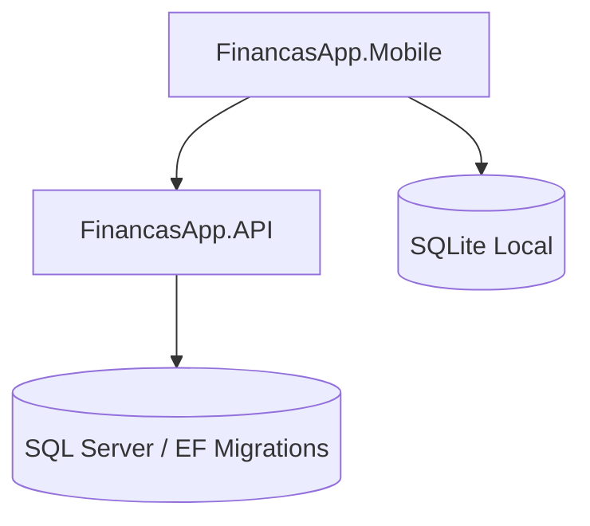
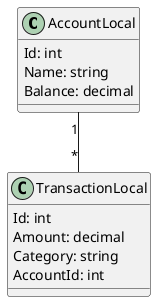

# 📘 FinancasApp — Documentação Oficial

## 🧭 Visão Geral
O **FinancasApp** é um sistema completo composto por **API ASP.NET Core (.NET 9)**, **aplicativo mobile MAUI**, e **banco SQLite** no dispositivo, com foco em controle financeiro pessoal.

Abaixo está a documentação inicial estruturada para expansão.

---

# 📄 README.md (Versão Inicial)

## 🚀 FinancasApp
Aplicativo de controle financeiro integrado a uma API própria. Suporta contas, cartões de crédito, faturas, transações, dashboards e login com autenticação JWT.

### ✔ Tecnologias Utilizadas
- .NET 9 — ASP.NET Core Web API
- MAUI .NET 9
- Entity Framework Core 9 (SQLite)
- AutoMapper
- CommunityToolkit

### 📦 Funcionalidades
- Cadastro e login
- Lançamento de transações (crédito, débito, transferência)
- Cartões de crédito e faturas
- Dashboards mensais
- Sincronização com API

### ▶ Como rodar
```bash
# API
cd FinancasApp.Api
dotnet ef database update
dotnet run

# Mobile
cd FinancasApp.Mobile
dotnet build
dotnet maui run -t android
dotnet maui run -t windows
```

---

# 📚 Documentação da API

## 🔐 Autenticação
`POST /auth/login`
- Body: `{ email, password }`
- Retorno: `token`, `expiresIn`, `user`

## 📂 Endpoints Principais

### 🧾 /transactions
- `GET /transactions` — lista transações
- `POST /transactions` — cria nova
- `PUT /transactions/{id}` — atualiza
- `DELETE /transactions/{id}` — remove

### 💳 /creditcards
- `GET /creditcards`
- `POST /creditcards`

### 📅 /invoices
- `GET /invoices`

> *A documentação detalhada (models, exemplos JSON, códigos HTTP) será expandida.*

---

# 📊 Diagramas (Mermaid + PlantUML)

## 🏗 Diagrama de Arquitetura (Mermaid)


---

## 🗂 Modelo de Domínio (PlantUML)


---

# 📱 Wireframes das Telas (Descrição Inicial)

## 🔑 Login
- Campo Email
- Campo Senha
- Botão Entrar
- Carregamento superior com logo

## 🏠 Dashboard
- Saldo total
- Gráfico pizza por categoria
- Lista de últimas transações

## ➕ Nova Transação
- Tipo (Receita, Despesa, Transferência)
- Valor
- Categoria
- Conta
- Observações

> *Wireframes visuais podem ser gerados sob demanda (figuras, diagramas ou protótipo em Mermaid).*

---

# 🗃 Migrações Automáticas SQLite
Ativar no startup:
```csharp
using var scope = app.Services.CreateScope();
var db = scope.ServiceProvider.GetRequiredService<AppDbContext>();
db.Database.Migrate();
```

Criação da migration:
```bash
dotnet ef migrations add InitialCreate
dotnet ef database update
```

---

# 💡 Sugestões de Melhorias Comerciais & Funcionais

## 🌟 Funcionalidades Futuras
- **Assinatura Premium:** relatórios avançados, exportação PDF e múltiplos perfis
- **Integração bancária automática (Open Finance)**
- **Notificações push de vencimentos**
- **Planejamento financeiro com metas e alertas**
- **Módulo de investimentos básico**

## 💼 Melhorias Comerciais
- Criar **versão white-label**
- Possibilitar **venda B2B para escritórios de contabilidade**
- Plano avançado com **IA para previsão financeira mensal**

---

Se quiser, posso gerar:
- 📄 documentação Swagger completa
- 🧪 exemplos de testes
- 🎨 wireframes visuais Mermaid
- 📦 estrutura de pastas detalhada
- 🔌 diagramas de sequência da API
- 📑 documentação PDF

É só pedir!

